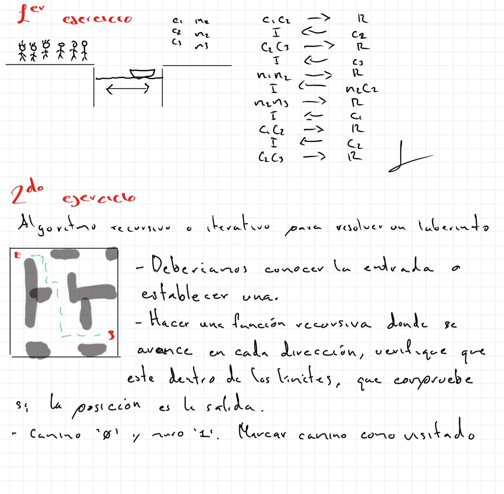

# Actividades de clase

## Enrique Martinez

### 1. Problema de los 3 caníbales y 3 monjes

El objetivo es encontrar una forma de pasar a los 3 monjes y 3 caníbales
de un lado del río al otro, respetando las restricciones del problema.

### 2. Resolver un laberinto

El objetivo es encontrar un camino desde la entrada hasta la salida del
laberinto. Para esto se pueden explorar las diferentes direcciones
posibles, evitando paredes y posiciones que ya hayan sido visitadas.

### Desarrollo de las actividades

A continuación se muestra la imagen con el desarrollo realizado en clase.

###### 27 de agosto 2026