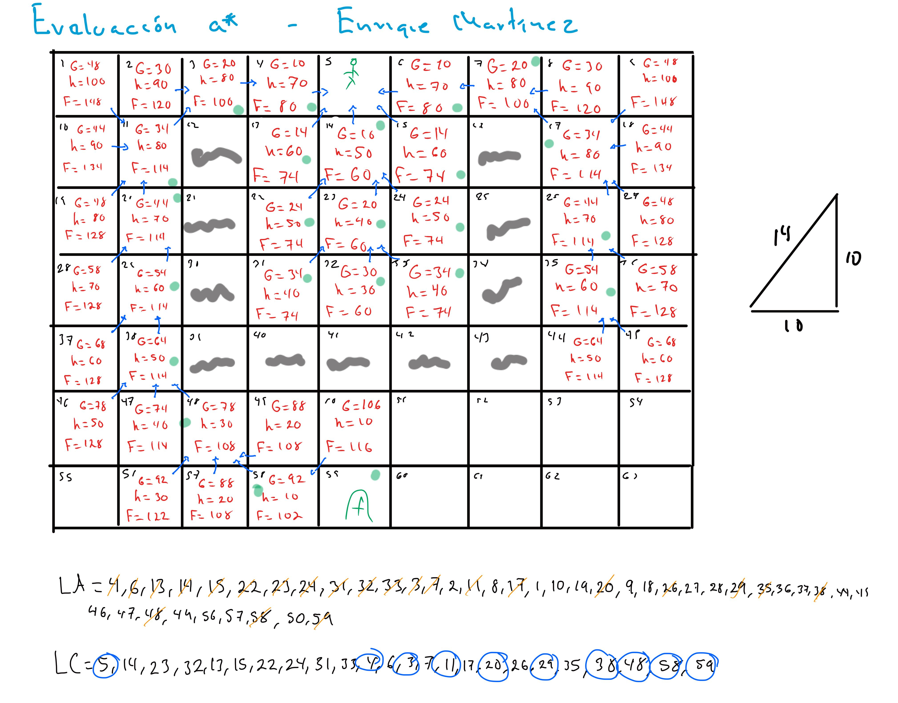

# Evaluacion en clase

## Enrique Martínez

### Algoritmo a*

- Resolver problemas mediante heuristicas
- F = g + h
- g = costo de moverme a mi destino mas cercano
- h = valor directo sin importar muros hasta el destino (Usando Manhattan)

### Ejercicio a*

###### 3 de septiembre 2026 - IA